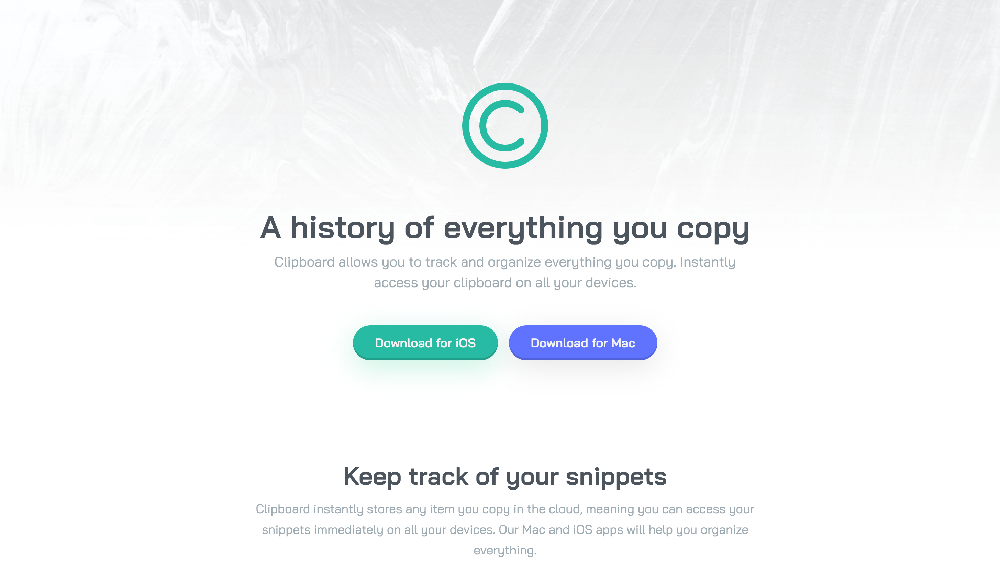
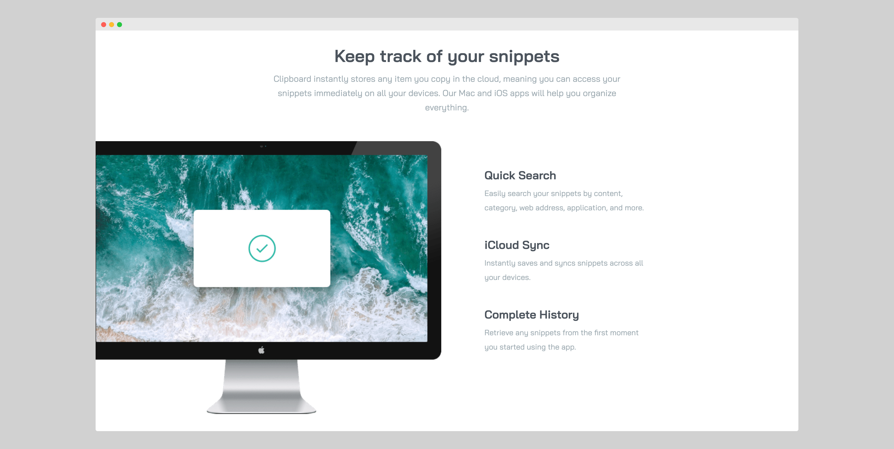

 
 

## Project Overview

This is my single-page website solution for the <a href="https://www.frontendmentor.io/challenges/clipboard-landing-page-5cc9bccd6c4c91111378ecb9" target="_blank">Clipboard Landing Page challenge</a> from <a href="https://www.frontendmentor.io/" target="_blank">Frontend Mentor</a> — an online learning platform that provides front-end developers with professional website designs to practice implementing.

 

The challenge was to implement the design as closely as possible and to meet two acceptance criteria:

1. Users should be able to view the optimal layout for the site depending on their device's screen size
2. Users should be able to see hover states for all interactive elements on the page

 

While this challenge could have been completed with just HTML and CSS, I wanted
to practice using React, TypeScript, and Storybook to build UIs.

 
 

## Process

From the outset, I wanted to use a <a href="https://www.componentdriven.org/" target="_blank">component-driven development</a> (CDD) approach that I first learned about in a course called <a href="https://www.newline.co/courses/storybook-for-react-apps" target="_blank">"Storybook for React Apps"</a>, by Storybook maintainer Yann Braga. It involves building UIs from the "bottom-up", starting with the smallest components, like buttons and icons, and then assembling them into larger pieces, like headers and forms, before finally putting them all together into pages. While this seemed like a logical approach to take in principle, in practice, it wasn't quite so straightforward. In the first place, I struggled to decide what elements of the landing page to turn into components. While some seemed like obvious candidates, like the buttons and icons, others, like the links, headings, and paragraphs, weren't so obvious. I couldn't see the utility of re-implementing these HTML elements with React — at least, not for this project.

 

Though the CDD approach espouses building out UIs with gradually increasing complexity,
I found in my case that starting small didn't necessarily mean starting simple. It
seemed like I was trying to build a more complex, polished system from the outset,
like writing a function that follows all the rules of "Clean Code" from the start
or writing the final version of an essay from the get-go. Instead, I opted to build
the rough first draft of the landing page with HTML and CSS and then extract components
from the markup to make it easier to understand, similar to how you might refactor
a long function into several smaller ones or write a bad first draft of an essay
before editing it. I then developed the components in isolation with Storybook.

 
 

## Technical Challenges

The top three technical challenges I encountered during this project were:

1. Positioning the iMac image in the "Keep track of your snippets" feature section
2. Extracting out a component for the feature sections and accounting for the different variations
3. Styling the different feature section variations

 
 

### Positioning the iMac image in the "Keep track of your snippets" feature section

Probably the most visually interesting part of this landing page design is the positioning of the iMac image in the snippets feature section. On the desktop version of the design, Its right edge aligns with the centre of the screen, while its left edge protrudes out to the left of the screen by about 30 pixels or so. To the right of the image are three features with short descriptions.

 

My first instinct was to use CSS Grid to create two equal columns for the image and features and then use absolute positioning to nudge the image out to the left of the screen by 30 pixels. However, this resulted in the right edge of the image no longer being aligned with the centre of the screen. I also tried scaling up the image using the CSS transform property and positioning it with the "left" and "right" properties, but this changed the image's aspect ratio. So, I ended up solving this by making the left column larger than the one on the right by 30 pixels and then moving the entire grid to the left by this same amount with absolute positioning. This both moved the image off the screen by 30 pixels and kept its right edge anchored to the centre of the screen.

 
 

 
 

### Extracting out a component for the feature sections and accounting for the different variations

While there are three different feature sections on this landing page, they share a lot of the same elements. Firstly, they all have a title and subtitle. Secondly, the first and last feature sections have an image as well as a list of features with short descriptions. So, I decided to extract a single component for the feature sections and keep the data for each of them in separate files. I could have passed the title, subtitle, image URL, and features as props to the component, but seeing as they always fit together, I decided to bundle them in a single parameter object.

 
 

### Styling the different feature section variations

Because the first feature section was styled a lot differently from the others, I had to somehow account for this in the component I extracted. I decided to make a separate "two-column layout" component with the layout-specific styles for the first feature section and then conditionally render it based on whether it had both an image and a list of features.

 

However, in hindsight, instead of conditionally rendering this layout component, I could have made the code express my intent more clearly and made a separate "Snippets Feature Section" component composed of both the original feature section component and the layout-specific styles and rendered it declaratively without any conditional logic.

 
 

## Lessons Learned

My biggest takeaway from this project was to start with a simple working solution before optimising it and increasing its complexity. For my current level of skill, that meant starting with an HTML and CSS implementation before migrating it over to React, which is how I plan on tackling my future projects.
