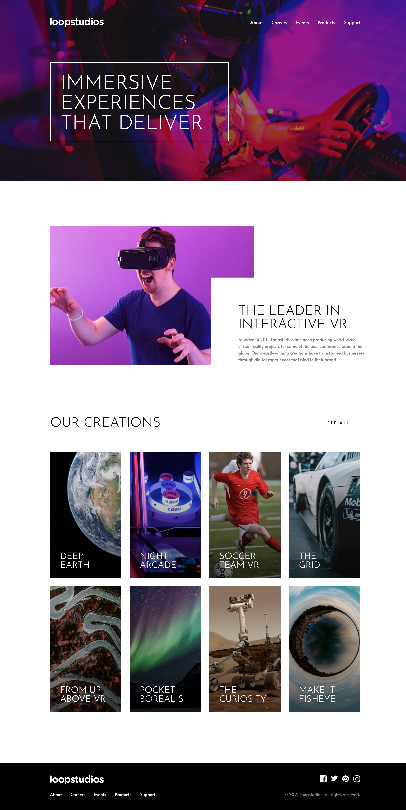

 
 

## Project Overview

This is my solution to the <a href="https://www.frontendmentor.io/challenges/loopstudios-landing-page-N88J5Onjw" target="_blank">Loopstudios Landing Page challenge</a> from <a href="https://www.frontendmentor.io/" target="_blank">Frontend Mentor</a>, built with React, TypeScript, and Tailwind CSS. The challenge was to build out the landing page to match the provided design as closely as possible and to allow users to:

 

1. View the optimal layout for the site depending on their device's screen
2. See hover states for all interactive elements on the page

 

I wanted to take on this challenge because it was a step up in difficulty from the previous Frontend Mentor challenge I undertook. It has features that I had never built before, such as a mobile navigation menu and some interesting colour and gradient overlay effects for some of the images.

 
 

## Solution

Although it wasn't a pixel-perfect solution, I managed to match the design fairly closely and meet the two acceptance criteria.

 
 

 
 

## Process

I followed the same "top-down" approach I adopted in the previous Clipboard Landing Page challenge. I began with a simple working solution using just HTML, Tailwind CSS, and JavaScript, and then migrated it to React, extracted components out from the markup, and used Storybook to develop the components in isolation.

 
While I have generally preferred this approach to the bottom-up or component-driven
development way of building UIs from the most basic building blocks up, I recently
learned from an article, <a
  href="https://frontendmastery.com/posts/building-future-facing-frontend-architectures/"
  target="_blank"
>
  "Building future facing frontend architectures"
</a> by <a href="https://frontendmastery.com/" target="_blank">
  Frontend Mastery
</a>
, that it is not one-size-fits-all. It argued that while the top-down approach of
building UIs may be more straightforward for smaller projects, it tends to lead to
monolithic components that are harder to change and maintain in larger ones. This
is something for me to keep in mind when I undertake larger projects in the future.

 
 

## Technical Challenges

The top three technical challenges I encountered during this project were:

1. Creating the mobile navigation menu
2. Styling the grid items in the "Our Creations" section
3. Styling the "About" section

 
 

### Creating the mobile navigation menu

A mobile navigation menu and hamburger button are visible on medium-sized screens and up. In my initial HTML, Tailwind CSS, and JavaScript solution, I added a click event listener to the button to toggle the visibility of the hamburger and "close" icons inside of the button, as well as the navigation menu, with Tailwind utility classes.

 

Because the mobile navigation menu fills the entire viewport when visible, one issue
that I encountered was that it stacked on top of the hamburger button that was inside
of the header and prevented the menu from being closed. Since browsers generally
render absolutely-positioned elements on top of non-positioned ones, to fix this
issue, I turned the header into a stacking context using the "isolate" utility class
and increased its z-index.

 

When migrating my solution to React, instead of toggling the visibility of the icons
and mobile menu using an event listener and Tailwind utilities, I created a component
for the hamburger menu with some state to represent whether the menu was open and
rendered it conditionally.

 

After I completed this project, I became aware of some accessibility and usability
issues with the hamburger menu and button that I created. While taking <a href="https://www.joyofreact.com/" target="_blank">Josh Comeau's
Joy of React course</a>, I learned about best practices such as locking keyboard focus
to the menu and removing the ability to scroll when the menu is open, allowing the
user to hit the escape key to close the menu, and adding various ARIA attributes
and visually hidden text to the hamburger button. I have since added these fixes
to my solution. In particular, I used the <a href="https://www.npmjs.com/package/react-focus-lock" target="_blank">react-focus-lock</a> and <a href="https://www.npmjs.com/package/react-remove-scroll" target="_blank">react-remove-scroll</a>
libraries recommended by Josh in the course to lock keyboard focus and remove the
ability to scroll.

 
 

### Styling the grid items in the "Our Creations" section

The main challenge in styling the grid items in the "our creations" section was creating the subtle black linear gradient over each item, which goes from left to right on mobile, and bottom to top on desktop. I initially wanted to apply the project image and gradient overlay as background images on the same element, so I defined the mobile and desktop versions of each image and gradient overlay in my custom Tailwind theme. However, I couldn't apply both on the same element without one utility class overriding the other. As a workaround, I created a pseudo-element on top of each project element and made it take up its full width and height with absolute positioning. I then applied the gradient overlay as a background image on that instead.

 
 

### Styling the "About" section

On the desktop version, the "about" section features an image of a man wearing a VR headset overlapped by some accompanying text about Loopstudios. To create this overlapping effect, I made the image and text children of a flex container, set a maximum width and some horizontal padding on the text, and then used absolute positioning to move the text from the top and right of its container.

 
 

## Lessons learned

The main things I learned from this project were how to implement a usable and accessible mobile navigation menu and apply gradient overlays on top of background images with Tailwind.
