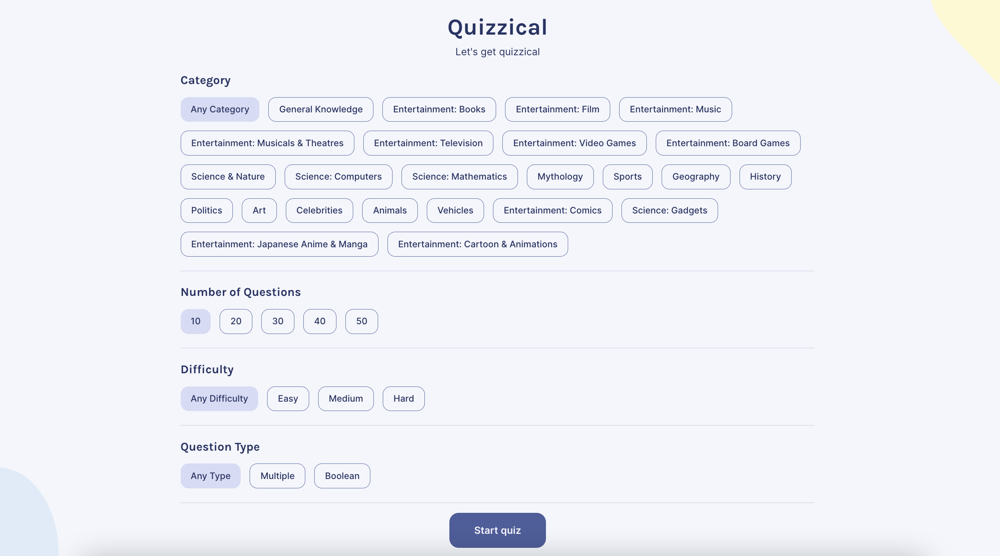
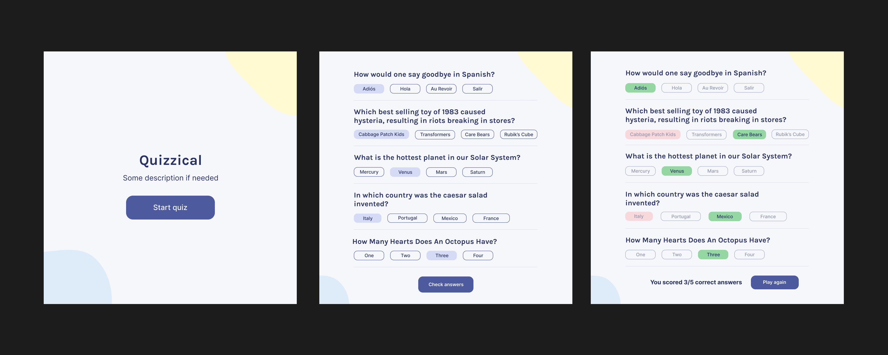
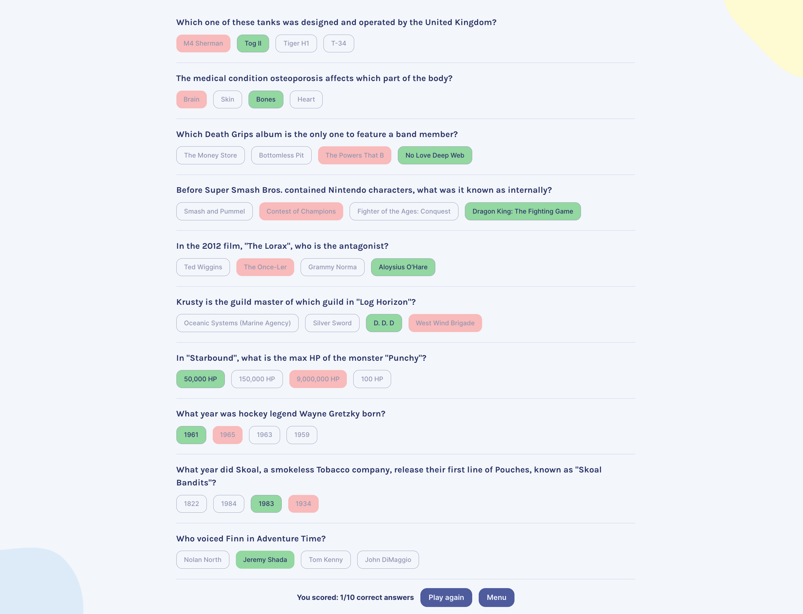

 
 

## Project Overview
Quizzical is a trivia application built with React, styled-components and the <a href="https://opentdb.com/" target="_blank">Open Trivia Database API</a>. This was a personal project of mine and an extension of the quizzical solo project from the React basics module in the <a href="https://scrimba.com/learn/frontend" target="_blank">Scrimba Frontend Developer Career Path</a>. The <a href="https://www.figma.com/file/E9S5iPcm10f0RIHK8mCqKL/Quizzical-App?node-id=0%3A1" target="_blank">original design</a> by <a href="https://scrimba.com/teachers/bobziroll" target="_blank">Bob Ziroll</a>, the teacher of the module, is shown below.
 

Apart from just having fun building something from scratch, the purpose of this project was to put into practice everything that I learned from Bob Ziroll in the React basics module, as well as what I learned about styled-components from <a href="https://www.joshwcomeau.com/" target="_blank">Josh Comeau</a> in his <a href="https://courses.joshwcomeau.com/css-for-js" target="_blank">CSS for JavaScript Developers Course</a>.
 
 

 
 

## Spotlight
My main extension to the Scrimba solo project was a start menu that allows users to choose what category, number, difficulty and type of questions they receive from the API.
 

To implement this feature, I stored the API URL in React state and made it update whenever the user chose a new quiz configuration option. Also, because a list of question categories and ids was made available as an API endpoint, I decided to get the categories data from the API and store it in state, instead of hard-coding it into my application like the other options.
 

A technical hurdle that I encountered when implementing this feature, was the mismatch between the data for the different options used to configure the API URL and how it was displayed to the user on the start menu.
 

For example, an "Any Category" was not provided by the API categories endpoint, but I wanted to allow the user to get trivia questions from any category. So, I decided to create a new piece of state that was synchronised to the categories state via an effect and append an "Any Category" option to it when the data was fetched from the API.
 

Some other technical hurdles that I found particularly tricky, included:
- How to reuse the fetch functionality of a custom `useFetch` hook that I wrote, so that the user can click a "Play Again" button and get another set of questions (I ended up returning the fetch function along with the data, and called it whenever the button was clicked).
- How to randomise the order of the answers so that the correct answer wouldn't be in the same spot every question (I decided to use the <a href="https://en.wikipedia.org/wiki/Fisher%E2%80%93Yates_shuffle" target="_blank">Fisher — Yates shuffle algorithm</a>.
- How to fix what seemed like a bug causing the quiz questions to render twice on mount (more on this later).
 
 

 
 

## Lessons Learned
One technical lesson that I learned from this project was to not overuse React state and effects to synchronise two pieces of state and to instead, figure out what should simply be derived from state.
 

For example, the score that I kept in my application was initially a piece of React state that was synchronised to the quiz data state via an effect. However, I realised after coming across <a href="https://www.newline.co/@brookslybrand/common-mistake-with-synchronizing-state-in-react--8ab767b5" target="_blank">this article</a>, that a much better solution was to simply derive the score before rendering it.
 

The biggest lesson that I learned (the hard way), however, was to not make any assumptions (or at least, question them) when debugging. 
 

What seemed like a bug from the way I was synchronising state, causing the quiz data to be fetched from the API twice and one set of questions being flashed before another set quickly replaced it, was actually a feature of Strict Mode in React 18. It turns out, whenever a component mounts in development, React will immediately unmount and remount the component, causing my data fetching effect to run twice.
 

I spent five, pointless hours late at night trying to debug this issue, making google searches like: "synchronising state between api data and own state triggering re-render react" and "how to prevent synchronised state from api data re-rendering component with new data react" (these are taken straight from my browser history).
 

In my mind, the cause of the bug was clear — the way I was synchronising state! But, if I had just taken a step back and described the symptoms of the problem without making a premature prognosis, I would have found the cause almost instantly. In fact, if I had searched something along the lines of: "effect running twice on mount react", I would have found the same <a href="https://stackoverflow.com/questions/61254372/my-react-component-is-rendering-twice-because-of-strict-mode" target="_blank">Stack Overflow answer</a> that resolved my issue, only a few results down on the first page.`
