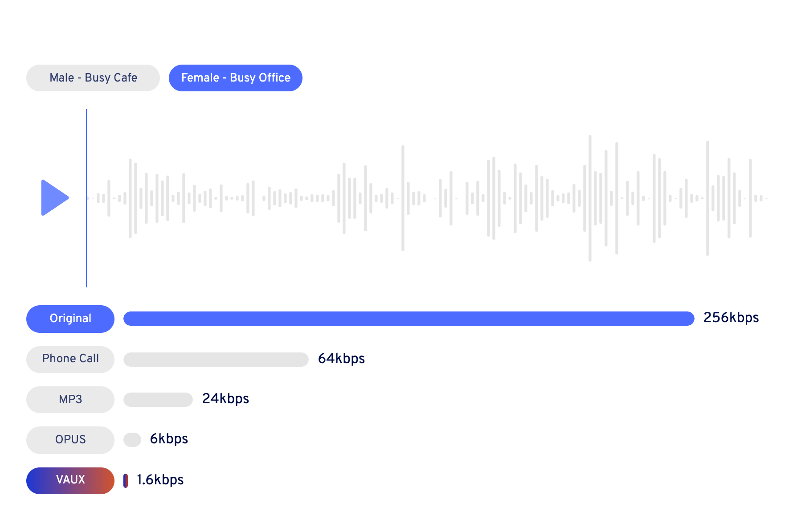
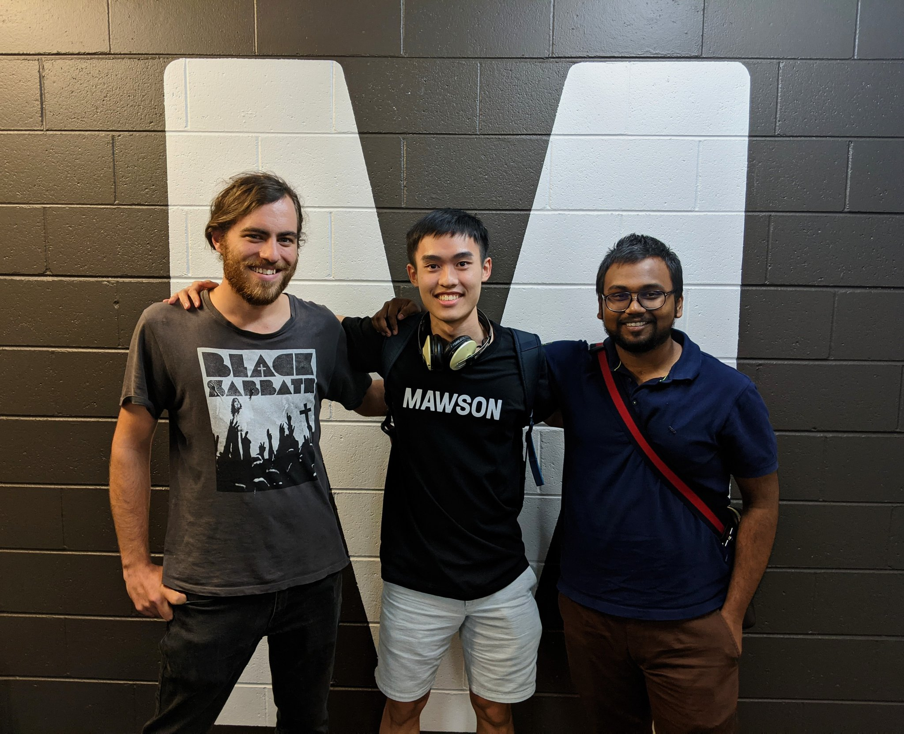

 
 

## Project Overview
VAUX was an early-stage Deep Tech startup in the voice AI space. 
Their mission was to be the future of voice streaming, by enabling 
communication in areas with poor internet connection.
 
My first project was to build a web-based technology demo 
of their audio compression and denoising deep learning model, so that it would 
be easier to pitch to investors. Once that was done, my next project was to 
revamp their landing page to make it more appealing to B2B enterprises.
 
 
 

## Execution

One of the biggest challenges I had was figuring out how to make the code 
future-proof and easy to change. I knew that this was crucial, because VAUX's 
deep learning model was always improving and generating new audio 
samples to showcase. That meant hard-coding all of the 
components for each audio sample was a big no-no.
 
To solve this problem, I decided to generate all of the HTML that could 
potentially change in the future (the waveforms, the toggle buttons for the 
different voices and audio samples and the bitrate stat bars) with JavaScript, 
using the DOM API.
 
 

 
 

## Results

The technology demo ended up being pitched to around 30 Deep Tech Venture
Capital firms in Australia, the US, UK and Japan. 
 
 

## Lessons Learned

One major lesson that I learned from these projects was to commit small, frequent 
changes to version control.
Although I had learned about this before, I had never really felt the pain 
associated with having to revert a lot of changes that weren't saved.
When the going was good, I kept adding changes to a feature that I had finally 
gotten to work but hadn't committed to GitHub. 
Once I broke it and couldn't rely on my trusty Ctrl-Z button, I started 
questioning all of my life choices. 
 

I can safely say that my long-term relationship with Ctrl-Z is now over and 
that I am now committed to committing small, frequent changes. 
 

